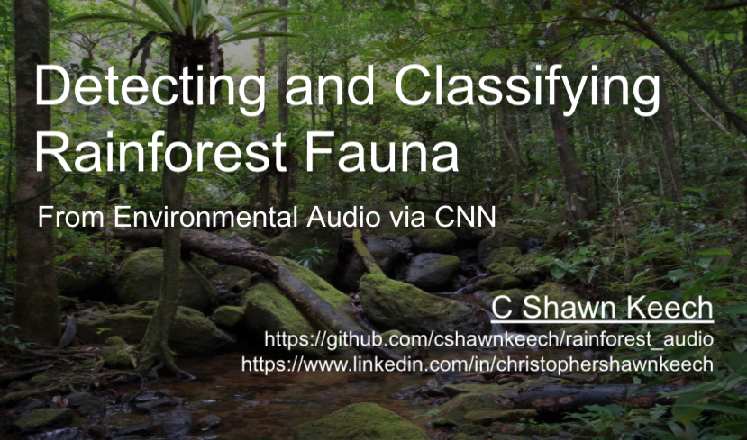
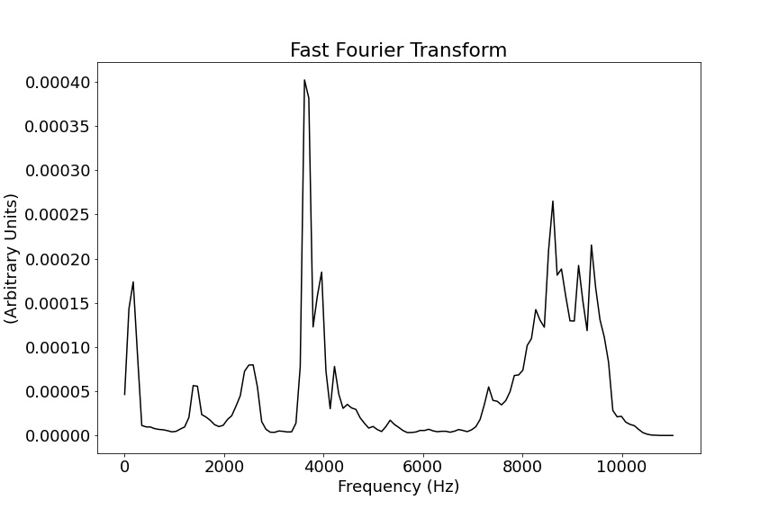

# Detecting and Classifying Rainforest Fauna From Environmental Audio via CNN

## C Shawn Keech
[CShawnKeech@Gmail.com](mailto:CShawnKeech@Gmail.com)
[GitHub](https://github.com/cshawnkeech/rainforest_audio)
[LinkedIn](https://www.linkedin.com/in/christophershawnkeech)

# Introduction

Imagine searching the photo above for rainforest creatures (sort of a very advanced game of "Where's Waldo").  It's not too hard to imagine the limitations that video has in meeting this challenge. Life can be quite small, have evolutionary camouflage advantages, and would have to be within a field of view to be detected.

Audio offers some distinct advantages in these situations. Recording devices can be small and have fewer resource requirements, omnidirectional microphones are readily available, and .high fidelity recordings offer smaller file sizes than video.

# Dataset & Model

The  [Rainforest Connection Species Audio Detection dataset hosted on Kaggle](https://www.kaggle.com/c/rfcx-species-audio-detection/overview) offered an opportunity to train a network to detect **24 species** of rainforest creatures using 1 minute environmental recordings. Recordings were recorded as 48kHz mono `.flac` files and human labeled.

I've used only the True Positive labeled examples to train this model.

# Audio Preprocessing

## Waveform

Many people (especially musicians who have used a modern DAW) may recognize visual representations of audio files such as the one below. The X axis represents time (in this case one minute of audio), and the Y axis represents amplitude.

## Fast Fourier Transform

Amplitude alone only tells part of a  sound's story. Imagine a drum set: the bass drum and snare drum may be played at the same volume (amplitude), but the bass drum exists in a much lower frequency range. A Fast Fourier Transform can help uncover amplitude at a given frequency.

