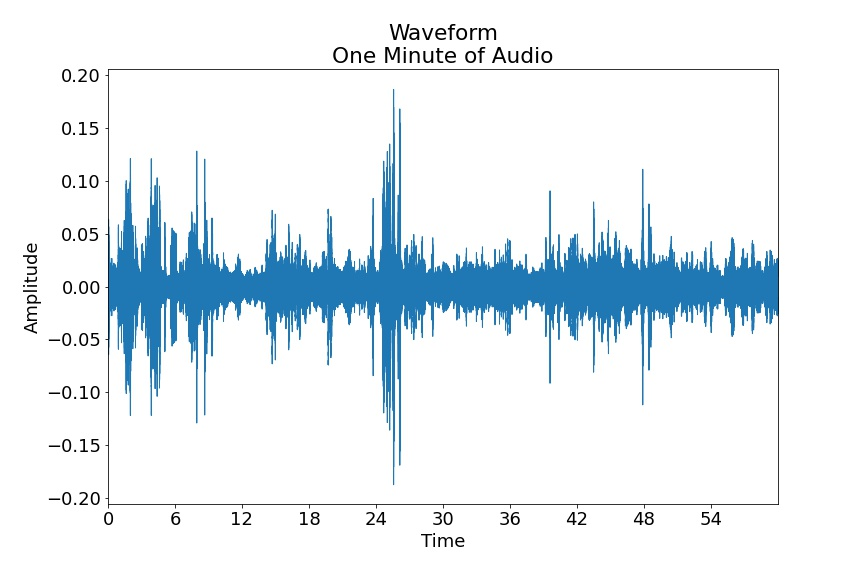
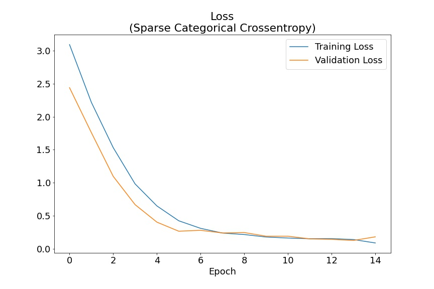
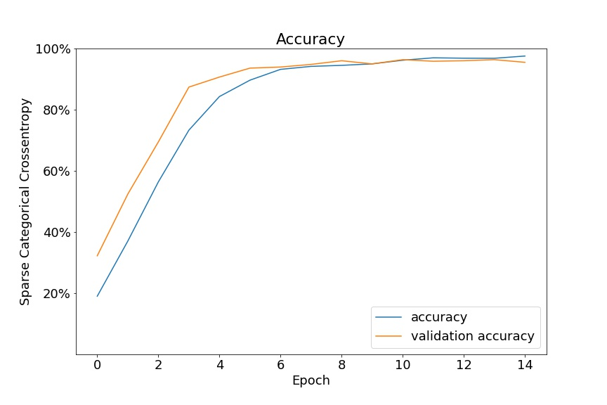
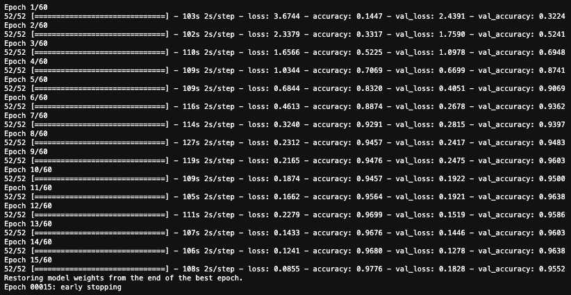

# Detecting and Classifying Rainforest Fauna From Environmental Audio via CNN

## C Shawn Keech

[CShawnKeech@Gmail.com](mailto:CShawnKeech@Gmail.com)
[GitHub](https://github.com/cshawnkeech/rainforest_audio)
[LinkedIn](https://www.linkedin.com/in/christophershawnkeech)

# Introduction

Imagine searching the photo above for rainforest creatures (sort of a very advanced game of "Where's Waldo").  It's not too hard to imagine the limitations that video has in meeting this challenge. Life can be quite small, have evolutionary camouflage advantages, and would have to be within a field of view to be detected.

Audio offers some distinct advantages in these situations. Recording devices can be small and have fewer resource requirements, omnidirectional microphones are readily available, and .high fidelity recordings offer smaller file sizes than video.

# Dataset & Model

The  [Rainforest Connection Species Audio Detection dataset hosted on Kaggle](https://www.kaggle.com/c/rfcx-species-audio-detection/overview) offered an opportunity to train a network to detect **24 species** of rainforest creatures using 1 minute environmental recordings. Recordings were recorded as 48kHz mono `.flac` files and human labeled.

I've used only the True Positive labeled examples to train this model.

# Audio Preprocessing

## Waveform

Many people (especially musicians who have used a modern DAW) may recognize visual representations of audio files such as the one below. The X axis represents time (in this case one minute of audio), and the Y axis represents amplitude.

## Fast Fourier Transform

Amplitude alone only tells part of a  sound's story. Imagine a drum set: the bass drum and snare drum may be played at the same volume (amplitude), but the bass drum exists in a much lower frequency range. A Fast Fourier Transform (FFT) can help uncover amplitude at a given frequency. The graph below plots the graph of a single sample (with Frequency on the X axis, and Power in arbitrary units on the Y axis).

## Challenges with the Fast Fourier Transform

The previous example was the FFT for only one sample. Each audio file has been sampled at 48kHz, so there are **48000 of these per second**. For fun, here's a plot for one second of audio where each line represents the FFT for one sample. 

## Conversion to Spectrogram

The spectrogram below contains the same information as the plot above. Now time (1 second) is on the X axis, Frequency is on the Y axis, and the power at any given frequency/time is on the Z axis. A convolutional neural network performs quite well when provided data in this format.

## Frequency Reduction

The black bands in the image above represent the high and low frequency boundaries wherein species 14 vocalizes. Sounds above and below this frequency are likely other species or environmental sounds such as wind, rainfall, or leaves rustling.

Species 14 (the example above) has vocalizations between  2531.25 and  6468.75 Hz.

Overall, the 24 species being detected have vocalizations that lie between **93.75**  & **13687.5** Hz. Our model will check only within this range for true positive samples.

# Model Training

## Loss (Sparse Categorical Crossentropy)

## Accuracy

## Confusion Matrix

# Next Steps

- Adjust Model to accommodate multiple simultaneous species vocalizations (as you can imagine, rainforest cretures rarely take turns)
- Enable processing of audio stream
- Deploy model online utilizing local microphone

# Appendix

## Credits:

Dataset: Rainforest Connection Species Audio Detection https://www.kaggle.com/c/rfcx-species-audio-detection/overviewRainforest 

Rainforest Image by [Frank Vassen](https://www.flickr.com/photos/42244964@N03/)(cc attribution):
https://www.flickr.com/photos/42244964@N03/4026784053

## Model Structure

After some initial research, this structure was chosen for its previous reliability in differentiating between voice commands. Classifying rainforest fauna vocalizations is somewhat similar

## Training Summary

## Classification Report

This report helps demonstrate differences in the models handling of individual species.

A few species show more room for improvement. Shortening the length of audio samples may aid in detecting these species.

